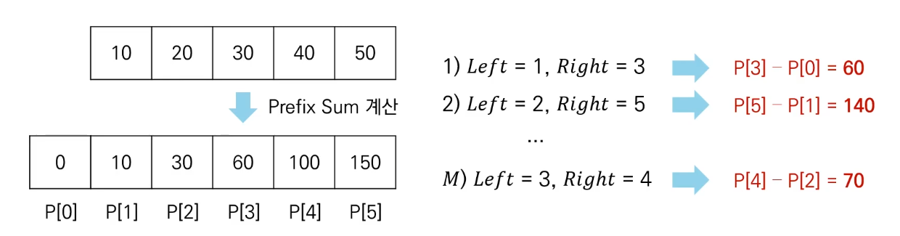

# 구간 합(Interval Sum)
  - 구간 합 문제 : 연속적으로 나열된 N개의 수가 있을 때 특정 구간의 모든 수를 합한 값을 계산하는 문제
  - 예를 들어 5개의 데이터로 구성된 수열 {10, 20, 30, 40, 50}이 있다고 가정
    - 두 번째 수부터 네 번째 수의 합은 20 + 30 + 40 = 90
  - 구간 합 빠르게 계산하기 
    - 접두사 합(Prefix Sum): 배열의 맨 앞부터 특정 위치까지 합을 미리 구해 놓은 것
    - 접두사 합을 활용한 알고리즘은 다음과 같다.
      - N개의 수 위치 각각에 대하여 접두사 합을 계산하여 P에 저장
      - 매 M개의 쿼리 정보를 확인할 때 구간 합은 P[right] - P[left -1]
ß

    
```python
n = 5
data = [10, 20, 30, 40, 50]

sum_value = 0
prefix_sum = [0]
for i in data:
    sum_value += i
    prefix_sum.append(sum_value)

left = 3
right = 4
print(prefix_sum(right) - prefix_sum(left-1))
```